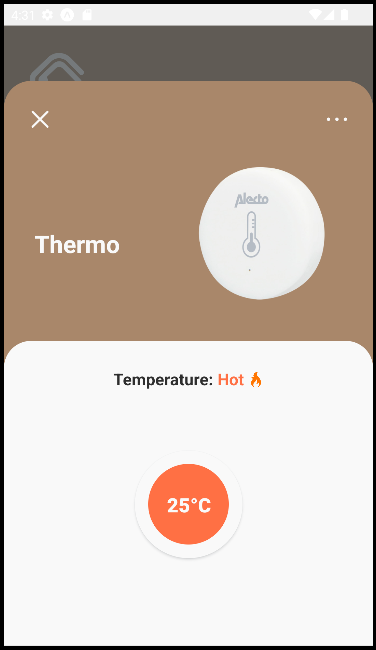
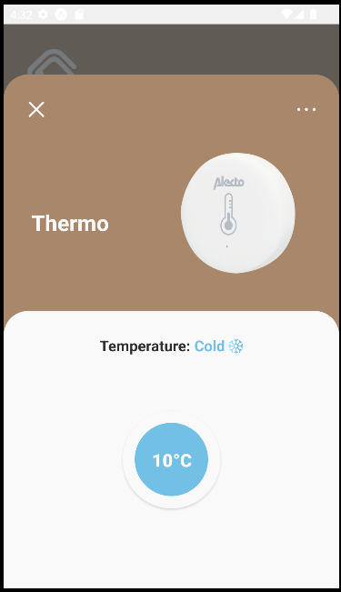
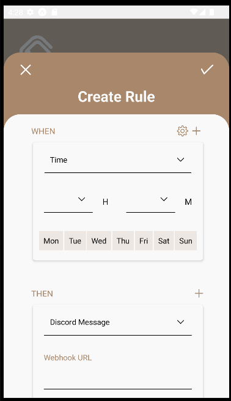

# House of Things

Welcome to the repository for the _House of Things_ project, developed in the context of the [ASSO/2022-23 course](https://sigarra.up.pt/feup/pt/ucurr_geral.ficha_uc_view?pv_ocorrencia_id=501938). Our product is a software system to monitor, control, and manage home automation devices and activities. We provide a user-friendly mobile frontend, as well as a robust backend capable of operating in contexts with multiple devices, including sensors, actuators and hubs.

<!-- Explain here in one or two sentences what are the goals of your product. -->

## Features and usage

Our product currently permits:

    - Configuring the system visually with an intuitive and aesthetically pleasing mobile application.
    - Checking the system state live by opening the respective device in the application. For virtual devices, it is also possible to check its state from its virtual control panel.
    - Adding triggers and actions, so that based on a given condition the state of the devices is changed.
    - Defining as an action sending a message to a Discord server through the corresponding WebHook URL.
    - Grouping devices in divisions, which may or may not correspond to physical divisions in your house.
    - Seeing the complete logs history of every task ever performed in your house.
    - Editing the server address in the settings page, so that this information can be updated without the need to access the code.
    - Using virtual devices. Moreover, our design is ready to extend to real devices and to new kinds of devices (with different state or protocol).
    - Discovering new devices that are available.
    - Integrating easily with other systems such as Discord or Whatsapp, provided that the integration program (i.e. Discord bot) communicates with our backend with the REST API we defined.
    - Easily deploying our backend to different kinds of hardware and infrastructure thanks to Docker, as well as our backend to different kinds of platforms (IOS, Android, Web) thanks to React Native.
    - Gracious exception handling.

<!-- Enumerate and describe the features (functional requirements) that your product currently provides -->

### Usage

<!-- Briefly explain how to use your software from the standpoint of its users. This can include a short video, one or two screenshots, and a textual explanation.-->

The users of our software will only need to interact with the phone's application provided. The following video briefly explains how to use our software from the standpoint of the users, showing some of the basic operations that they can perform.

  
  
<i>Figure 1: House of Things Application Demo</i>

To **add a device**, just click on the `+` button always visible in the navigation bar, choose the respective category, and fill in the device form indicating which of the available devices is to connect, its name, and division (if any). After having a device connected, it is possible to **change its configuration**, including renaming and even disconnecting, from its details page, which is accessed by clicking on the device's card. This card already includes some shortcuts for some of the most common actions or readings for each device.

On the home page, the user can also **add new divisions** and associate devices to them. To **see the details of a division**, just press and hold on to the respective division, as only one click corresponds to the filter action.

**Managing the system's rules** is done through the 2nd option in the navigation menu. The user can see all the list of all the rules that exist and add a new one. Regarding a rule, a user can see it in detail, edit and delete it and even run it manually.

The house's **log history** is listed in the 3rd option of the navigation menu. The 4th menu option corresponds to the settings page where the user **configures the address** where the server is running.

--

To simplify the demonstration, the thermometer is excluded, however, below are some screenshots that represent the visual appearance that the user can expect when using this device, visualizing its temperature.

  
  
  
<i>Figure 2: House of Things Application - Thermometer Details</i>

Furthermore, regarding the rules it is possible to specify (besides conditions and actions related to the devices) a condition depending on the time, indicating hours and days, and an action related to notifications, specifically a message for discord.

  
  
<i>Figure 3: House of Things Application - Create Rules</i>

## Getting started with development

<!-- Very briefly explain how to build, run the tests and run the application itself in a development environment. -->

In order to run the application, you need to run both the frontend and the backend. For the backend, you may use docker with the commands `docker-compose build` to build and `docker-compose up` to run in the `backend` folder. For more information, namely regarding environment variables, see the [backend README](backend/README.md). For the frontend you may install dependencies with `npm install` and run with the command `npm start` in the `frontend` folder, and then scan the QR code in the console with your phone (provided you have installed [ExpoGo](https://expo.dev/client)). You may need to change the server IP address to connect to the backend in the `frontend/.env` file. For more information, see the [frontend README](frontend/README.md).

You may want to connect virtual devices to test the application. For running virtual devices, refer to the [devices README](devices/README.md).

## Packaging and deploying

Running the backend in production mode is very convenient. You basically just need to set the flag `APP_ENV` to `production` in your `.env` file before running `docker-compose up`. However, you are also **strongly encouraged** to set secure passwords for the database and broker, as well as the broker host, since you are deploying to production. For more information, see the [backend README](backend/README.md). Since docker is being used, the backend shoud be portable to different kinds of hardware and infrastructure that support docker, from Raspberry Pis to cloud services. The logs to monitor the backend may be found in the `backend/logs` folder.

For the frontend, you may run `npm start --no-dev --minify` to quickly run the application as if it were in production mode. On the other hand, in case you intend to actually deploy the application to the app stores, you may run `eas build --profile production` to build and then `eas submit` to deploy. Note that this will require you to enter your credentials to an Expo account, which must have paid membership to the Google Play Store and/or Apple App Store in order to actually deploy to the stores. You can, alternatively use `eas build --profile preview` to package if you don't want to submit to the app store. Once the build is complete you only need to go to the link given in the console to download the APK or installer. More information about deployment may be found in the [EAS Build docs](https://docs.expo.dev/build/introduction).

## Design and architecture

- [Domain analysis](docs/domain-analysis.md) <!-- Includes description of the domain, illustrated by a domain model (UML class diagram). -->
- [Architectural overview](docs/architectural-overview.md) <!-- Includes description of the architecture, illustrated by architectural diagrams (UML component and/or deployment diagrams). The description should enumerate and describe the quality attributes (non-functional requirements) that your product currently provides, and how does that relate to the architecture. -->
- [Pattern instances](docs/pattern-instances.md) <!-- See sample file for further instructions -->
- [Technology choices](docs/technology-choices.md)

## Group members

| Name               | Number    |
| ------------------ | --------- |
| Henrique Nunes     | 201906852 |
| Margarida Ferreira | 201905046 |
| Patrícia Oliveira  | 201905427 |
| Pedro Correia      | 201905348 |
| Sara Marinha       | 201906805 |
| Victor Nunes       | 201907226 |
