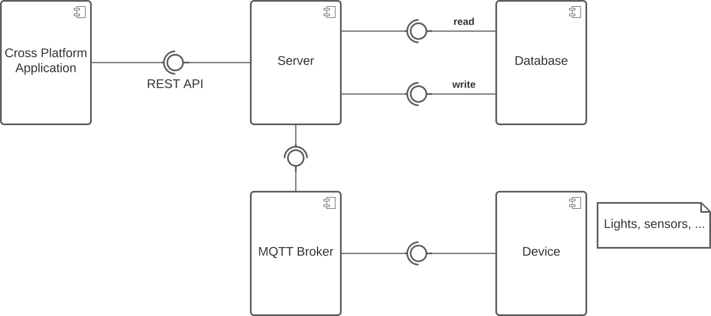
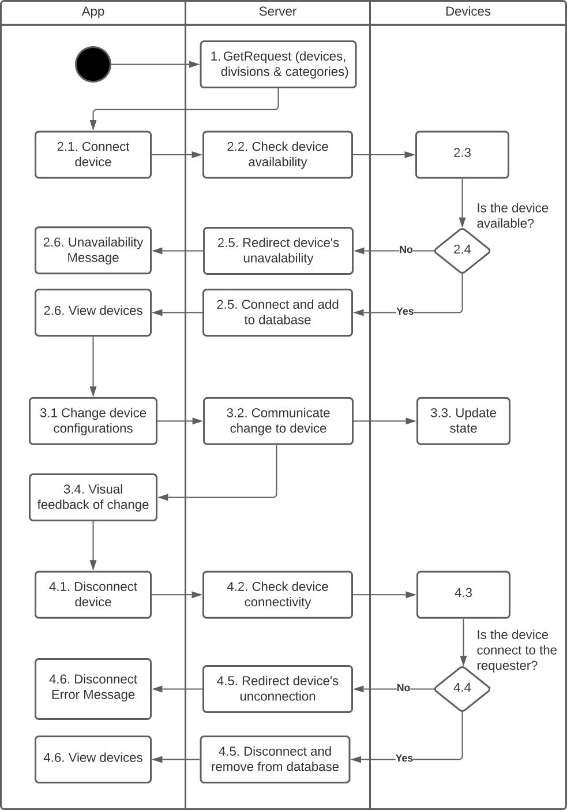
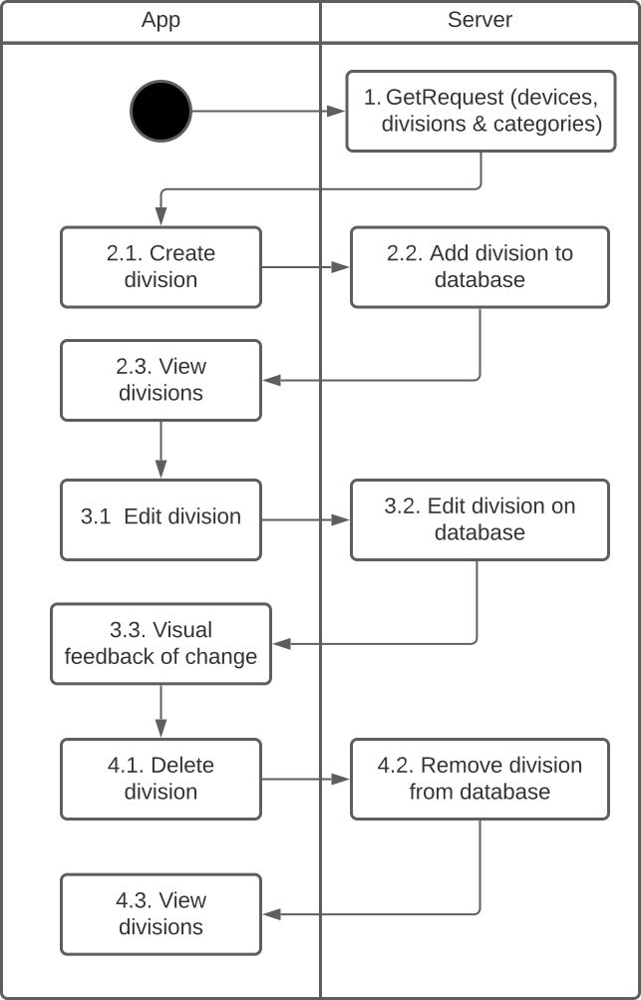
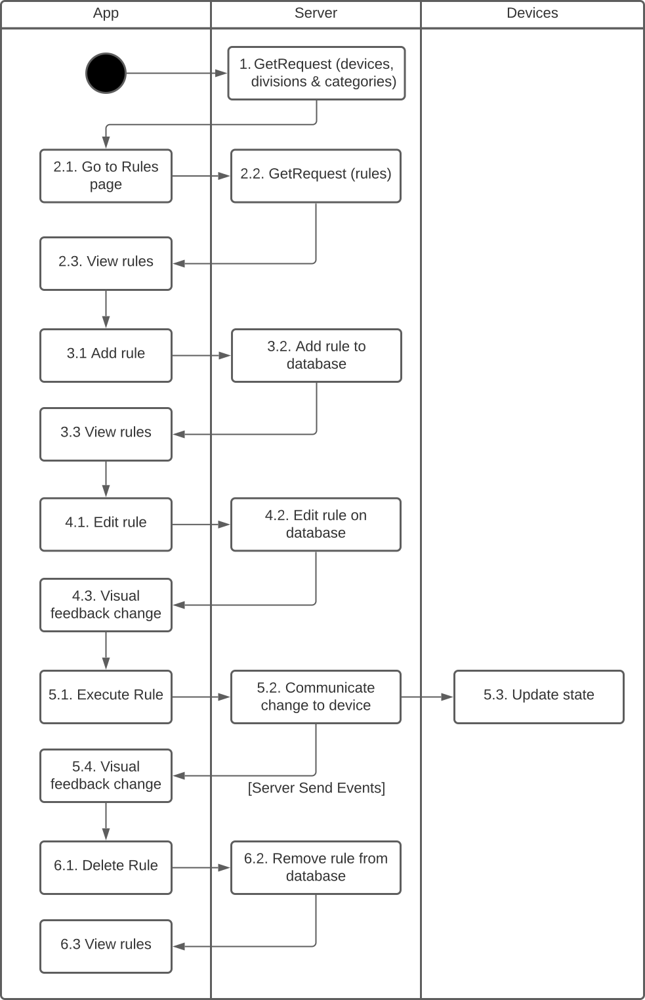
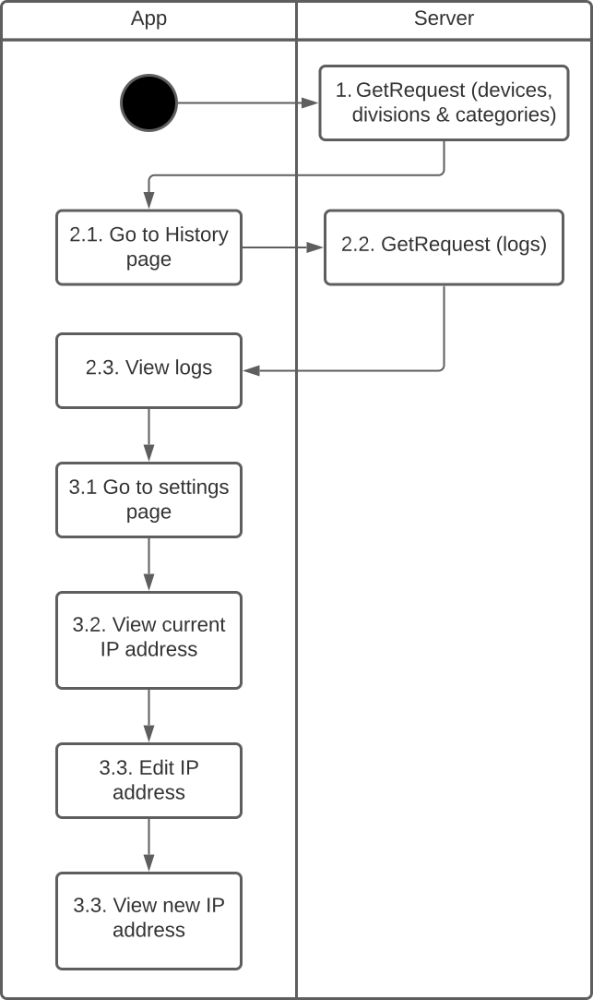
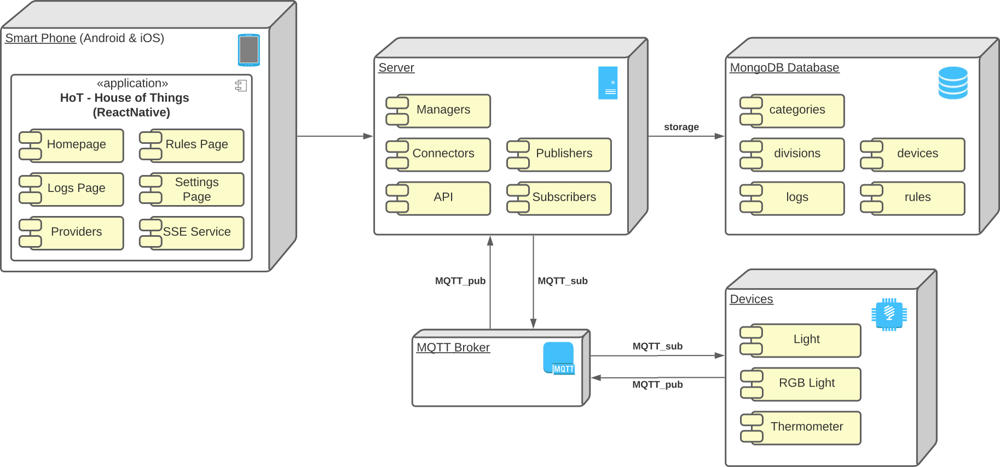

# Architecture Envisionment

Our system follows a client-server architecture, where a cross-platform frontend application communicates with a backend via REST API.

The frontend is implemented in React Native, since it is a cross-platform framework tailored for a mobile experience and we expect most of our users to interact with our system with their phone. The separation of the frontend from the backend also permits implementing other kinds of frontends in the future, such as a Discord bot that directly interacts with the server endpoints, or an alternative application using different technologies, such as a native desktop application or a website.

The server is implemented in Python's Flask framework, since it is a lightweight framework that we can easily extend according to our needs. Namely, it allows us to more easily use a non-relational database, which would have been harder to do with other frameworks, such as Django. This server follows the model-view-controller architectural pattern, where the views are REST API endpoints, the models represent database entities and the controllers manage the logic of the application and interaction with the devices. We found this architectural pattern natural given that the server is web-based, allowing us to separate the logic of the application from the requests and responses, as well as the stored data.

The server communicates with the devices via MQTT, which is a lightweight messaging protocol that is well-suited for IoT applications. The devices may be physical or virtual. In the case of virtual devices, they are simple programs implemented in Python with a UI in pygame, given that their main purpose is to test the application.

For the database, we chose MongoDB, given that we anticipate that the data stored for different IoT devices and the rules users can create will be very heterogeneous and must be capable to adapt to multiple different protocols and types of devices.

In general, we can consider our architecture layered, with a frontend layer that depends on the server layer, which in turn depends on the database and broker/devices. The server layer can be further subdivided into an API view layer, which depends on a controller layer, which in turn depends on a model layer, which finally depends on a database connection layer to abstract the database connection.

We chose to implement our server with an Object Oriented architecture, in order to facilitate the separation of concerns, the reuse of code, and data abstraction. On the other hand, we did not choose that approach for the frontend, since the best practices of React Native suggest not using that approach (it is suggested the use of Function Components rather than Class Components).

## Component Diagram

The component diagram describing our architecture is illustrated below.

  
  
<i>Figure 1: House of Things Component Diagram</i>

### Components

The HoT system contains the following components:

- **Cross-Platform Application**: provides a user interface for users to interact with the system, allowing them to send requests and receive feedback.
- **Server**: handles requests via REST API and sends and receives messages to and from the MQTT broker to interact with the devices, which can include retrieving data from sensors or sending commands to actuators. Also retrieves or updates data from the database as needed.
- **MQTT Broker**: serves as the middleman between the server and the devices, facilitating communication between the two.
- **Devices**: generate data that is transmitted to the server, e.g., sensors that detect changes in the physical environment, such as temperature or humidity or actuators that can trigger actions in response to commands from the server. May be physical or virtual.
- **Database**: stores all the necessary data.

## Server Component Diagram

Since the server is the most complex component of our system, we have created a separate component diagram with its sub components, which is illustrated below:

  
  
<i>Figure 2: House of Things Component Diagram (Server)</i>

### Components

The HoT backend server contains the following components:

- **API**: serves as the view in the MVC pattern, exposing the endpoints and calling the controllers to handle the requests.
- **Controller**: handles application logic, with its main sub components: the **Managers**, which handle the logic for the endpoints related to a given entity, and the **Connectors**, which handles the protocols for communicating with the devices via MQTT broker.
- **Model**: represents entities to be stored in the database.
- **Database Connection**: abstracts the database connection.

## Activity Diagram

The activity diagram describing how our system behaves is illustrated below. To ease the readibility, it was divided by 4 main concepts: devices, divisions, rules and logs.

  
  
<i>Figure 3: House of Things Activity Diagram - Devices</i>

  
  
<i>Figure 4: House of Things Activity Diagram - Divisions</i>

  
  
<i>Figure 5: House of Things Activity Diagram - Rules</i>

  
  
<i>Figure 6: House of Things Activity Diagram - Logs and Settings</i>

## Deployment Diagram

The deployment diagram describing how our system is deployed is illustrated below.

  
  
<i>Figure 7: House of Things Deployment Diagram</i>

### Nodes and Components

The HoT system contains the following nodes and respective components:

- **Smart Phone**: mobile device (Android and/or iOS) that has the `HoT - House of Things` application installed.
- **Server**: machine that has the server running with which the phone can communicate with to request data.
- **Database**: machine that has allocated the storage database. The server must establish a connection to it.
- **MQTT Broker** (public): facilitates communication between the server and devices using the publish-subscribe (PUB-SUB) messaging protocol.
- **Devices**: virtual and physical IoT devices with a specific communication protocol.
