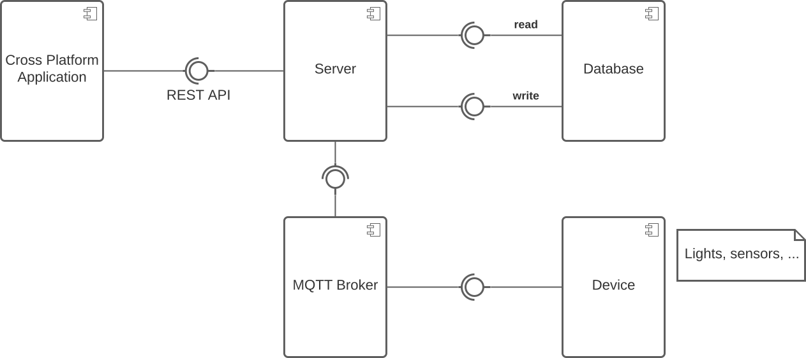
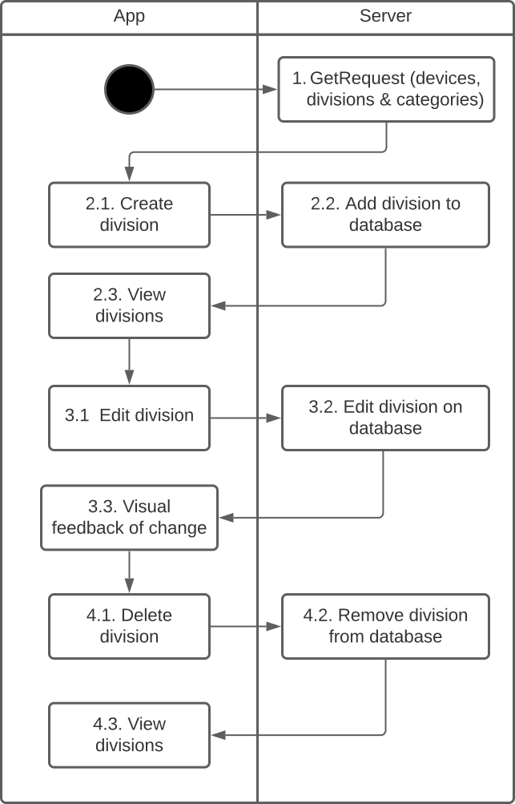
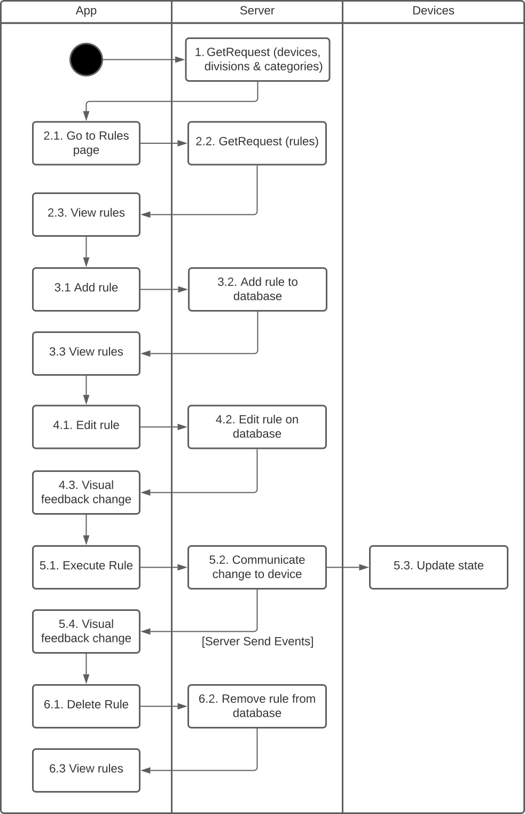
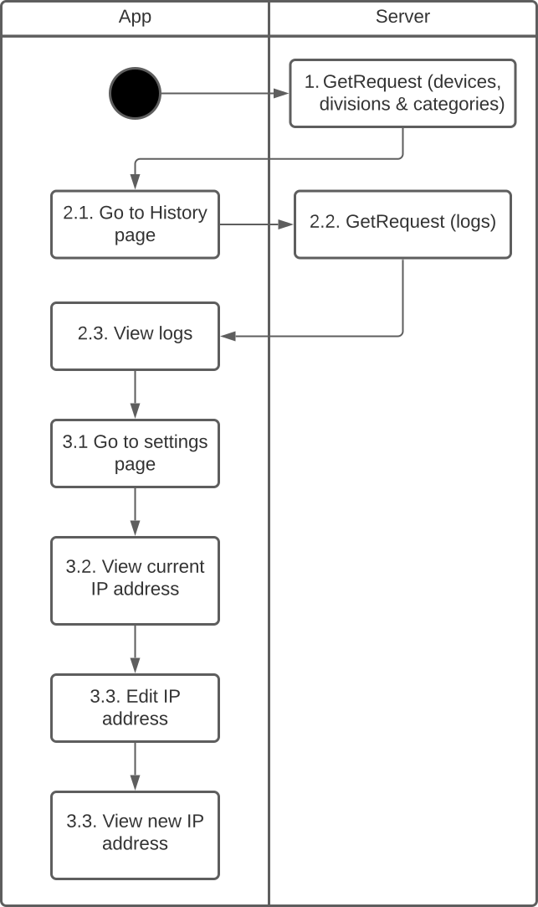
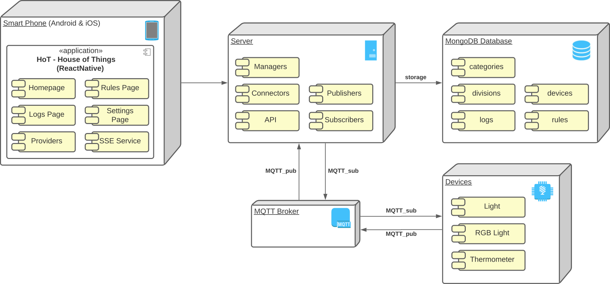

# Architecture Envisionment

Our system follows a client-server architecture, where a cross-platform frontend application communicates with a backend via REST API.

The frontend is implemented in React Native, since it is a cross-platform framework tailored for a mobile experience and we expect most of our users to interact with our system with their phone. The separation of the frontend from the backend also permits implementing other kinds of frontends in the future, such as a Discord bot that interacts with the server.

The server is implemented in Python's Flask framework, since it is a lightweight framework that we can easily extend according to our needs. Namely, it allows us to more easily use a non-relational database, which would have been harder to do with other frameworks, such as Django. This server follows a model-view-controller architectural style, where the views are REST API endpoints, the models represent database entities and the controllers manage the logic of the application and interaction with the devices. We found this architectural style natural given that the server is web-based, allowing us to separate the logic of the application from the requests and responses, as well as the stored data.

The server communicates with the devices via MQTT, which is a lightweight messaging protocol that is well-suited for IoT applications. The devices may be physical or virtual. In the case of virtual devices, they are simple programs implemented in Python with a UI in pygame, given that their main purpose is to test the application.

For the database, we chose MongoDB, given that we anticipate that the data stored for different IoT devices and the rules users can create will be very heterogeneous.

## Component Diagram

The component diagram describing our architecture is illustrated below.

  
  
<i>Figure 1: House of Things Component Diagram</i>

### Components

The HoT system contains the following components:

- **Cross-Platform Application**: provides a user interface for users to interact with the system, allowing them to send requests and receive feedback.
- **Server**: handles requests via REST API and sends and receives messages to and from the MQTT broker to interact with the devices, which can include retrieving data from sensors or sending commands to actuators. Also retrieves or updates data from the database as needed.
- **MQTT Broker**: serves as the middleman between the server and the devices, facilitating communication between the two.
- **Devices**: generate data that is transmitted to the server, e.g., sensors that detect changes in the physical environment, such as temperature or humidity or actuators that can trigger actions in response to commands from the server. May be physical or virtual.
- **Database**: stores all the necessary data.

## Activity Diagram

The activity diagram describing how our system behaves is illustrated below. To ease the readibility, it was divided by 4 main concepts: devices, divisions, rules and logs.

  
  
<i>Figure 2: House of Things Activity Diagram - Devices</i>

  
  
<i>Figure 3: House of Things Activity Diagram - Divisions</i>

  
  
<i>Figure 4: House of Things Activity Diagram - Rules</i>

  
  
<i>Figure 5: House of Things Activity Diagram - Logs and Settings</i>

## Deployment Diagram

The deployment diagram describing how our system is deployed is illustrated below.

  
  
<i>Figure 6: House of Things Deployment Diagram</i>

### Nodes and Components

The HoT system contains the following nodes and respective components:

- **Smart Phone**: mobile device (Android and/or iOS) that has the `HoT - House of Things` application installed.
- **Server**: machine that has the server running with which the phone can communicate with to request data.
- **Database**: machine that has allocated the storage database. The server must establish a connection to it.
- **MQTT Broker** (public): facilitates communication between the server and devices using the publish-subscribe (PUB-SUB) messaging protocol.
- **Devices**: virtual and physical IoT devices with a specific communication protocol.

<!-- ## Several subsystems and how they are connected

We have two main subsystems, UI and Server that communicate through Rest API.

In the context of the project, devices will be mainly virtual (mocks) and will communicate with the Server through MQTT.

## Main architectural and design challenges

1. How will the data from the sensors be filtered?
2. How will the rules of the system be defined?
3. How to deal with the different configurations of the devices (even in devices of the same type)
4. How to make our system fault-prone?
5. How to store the history of devices for later analysis?
6. How to design our system to be able to extend to work in real-world mode, connecting to real devices?
7. How to make our system to be easily extendend to different types of devices?
8. How to detect new devices in the network (plug and play)?
9. How to ensure our system is secure?

## Patterns we plan on using to address those challenges

1. Pipes and Filters Architecture: for processing the data received from the sensors, performing data filtering (e.g. remove data that is outside a certain range) and/or data transformation (e.g. transform data from different sources into a standardize format).
2. Rule-based Architecture: to define the behavior of the system based on the data collected from the IoT devices making it easier to maintain and modify as the rules can be updated or added without requiring changes to the underlying code.
7. Microservices Architecture (Independent Components style): services/modules developed and deployed independently, making it easier to scale and maintain the system. -->
