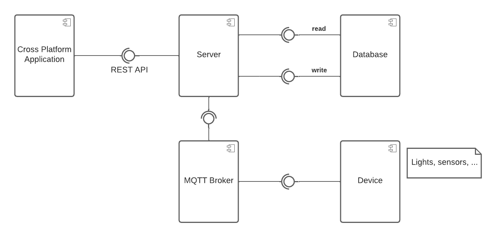

# House of Things - Component Analysis

## Description

The component diagram for this IoT system consists of: a cross-platform application that communicates with the server via REST API; a server that can both read from and write to a database and also communicates with an MQTT broker to interact with the devices; an MQTT broker, which facilitates communication between the server and the devices; the devices, which may include sensors and actuators that interact with the physical environment; and a database, which stores all the necessary data.

## Component Diagram

The component diagram described in the previous section is illustrated below.

  
  
<i>Figure 1: House of Things Component Diagram</i>

### Components

The HoT system contains the following components:

- **Cross-Platform Application**: provides a user interface for users to interact with the system, allowing them to send requests and receive feedback.
- **Server**: sends messages to the MQTT broker to interact with the devices, which can include retrieving data from sensors or sending commands to actuators and retrieves or updates data from the database as requested.
- **MTTQ Broker**: serves as the middleman between the server and the devices, facilitating communication between the two.
- **Devices**: generate data that is transmitted to the server, e.g., sensors that detect changes in the physical environment, such as temperature or humidity or actuators that can trigger actions in response to commands from the server.
- **Database**: stores all the necessary data.