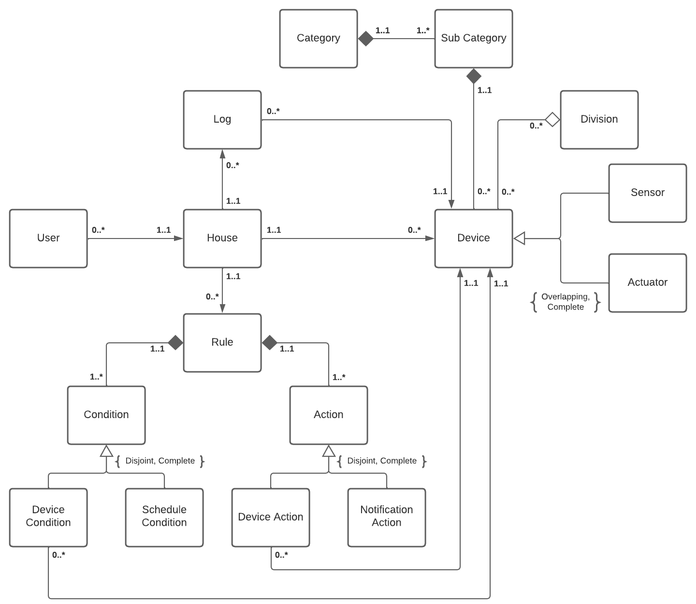

# House of Things - Domain Analysis

## Domain Description

Home IoT (House of Things) is a system that groups multiple devices of different types with which a user interacts. In addition, the devices are also able to interact with each other.

Any device can be considered a sensor, an actuator, or both. Within these groups the possibilities are limitless, however their easy extension must be ensured. Furthermore, devices are of a certain type that fall into a category. A device can still be associated with divisions (groups created by the user not necessarily associated with a physical space).

The system is fully configurable through the definition of rules, where actions are defined for one or more triggers. Both actions and triggers can be of different natures.

Viewing and managing the status of a device live are essential tasks. It is therefore possible to know what is happening at any moment as well as to have access to the history of changes, in order to be able to find possible inconsistencies.

## Domain Model

The domain described in the previous section is illustrated by the UML diagram below.

  
  
<i>Figure 1: House of Things Domain Model</i>

### Entities

The HoT domain model contains the following main entities:

- **House**: central logic entity
- **Device**: virtual and physical entity that has intelligent capabilities
- **Category**: generic aggregator of different types of devices (eg.: lights, sensor...)
- **SubCategory**: specific types of devices (e.: thermometer)
- **Division**: virtual aggregation of several devices of one or more kind
- **Rule**: statement that defines the conditions that must be met for a certain action to be performed
- **Condition**: statement that is verified
- **Action**: statement that is executed
- **Log**: historic of the system's past events
- **User**: person that interacts with the system

### Relationships

In this diagram, the problem is schematized from a more abstract and conceptual point of view.

A user lives and interacts with a given house, while each house can have multiple users associated with it.

A house is made up of several devices, sensors and actuators. Each device is composed by a sub-category which is composed by a category. In addition, a device can also be aggregated to a division. Each division and subcategory can have zero or multiple devices associated with it.

A house has a set of rules associated with it. Rules are composed of conditions and actions. Conditions can be associated with a device or a schedule. Actions can be associated with a device or a notification.

A home also stores the history of changes in the state of a device.
