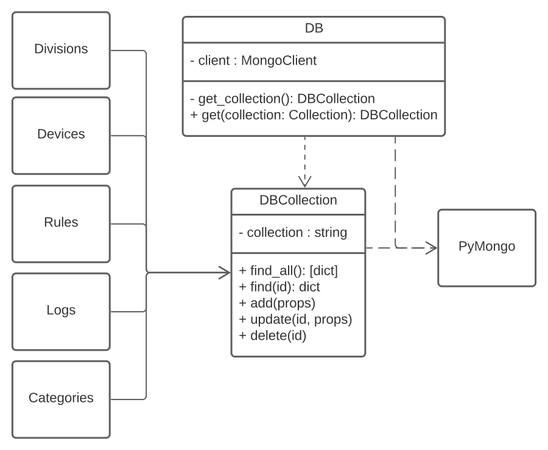
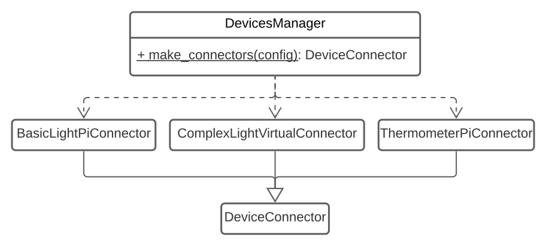
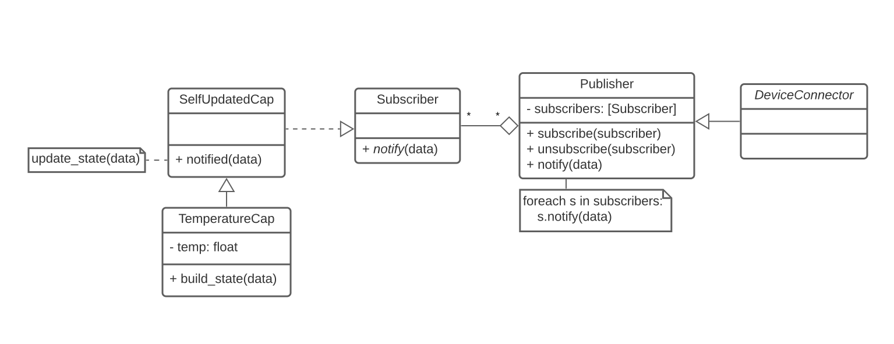
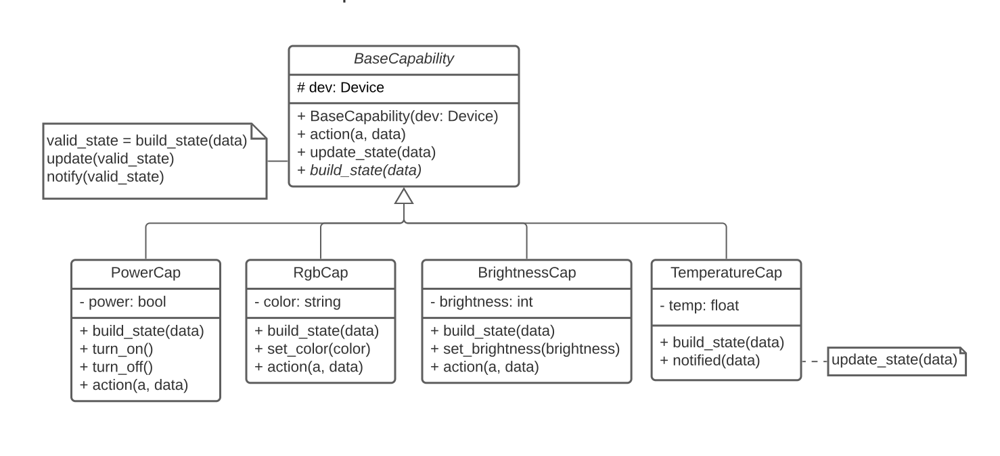
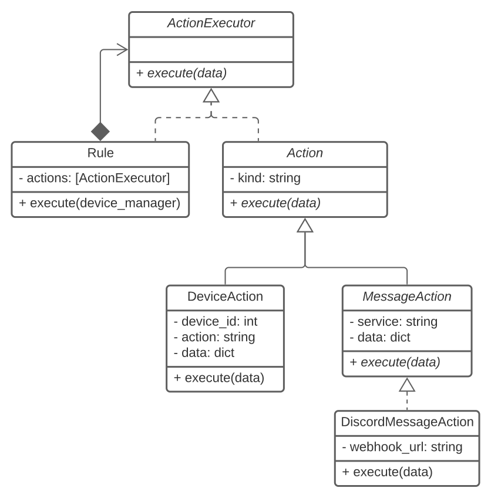
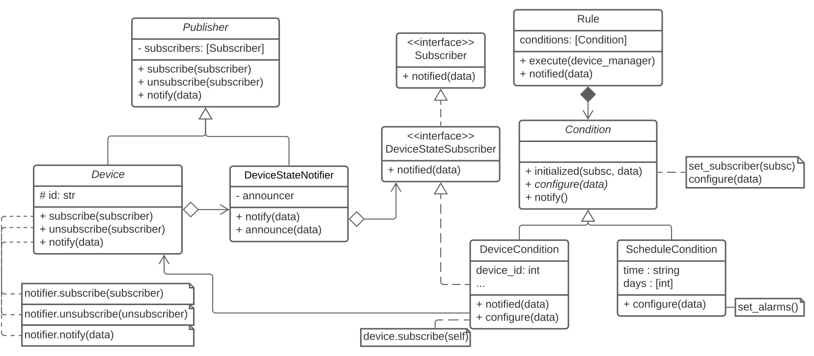
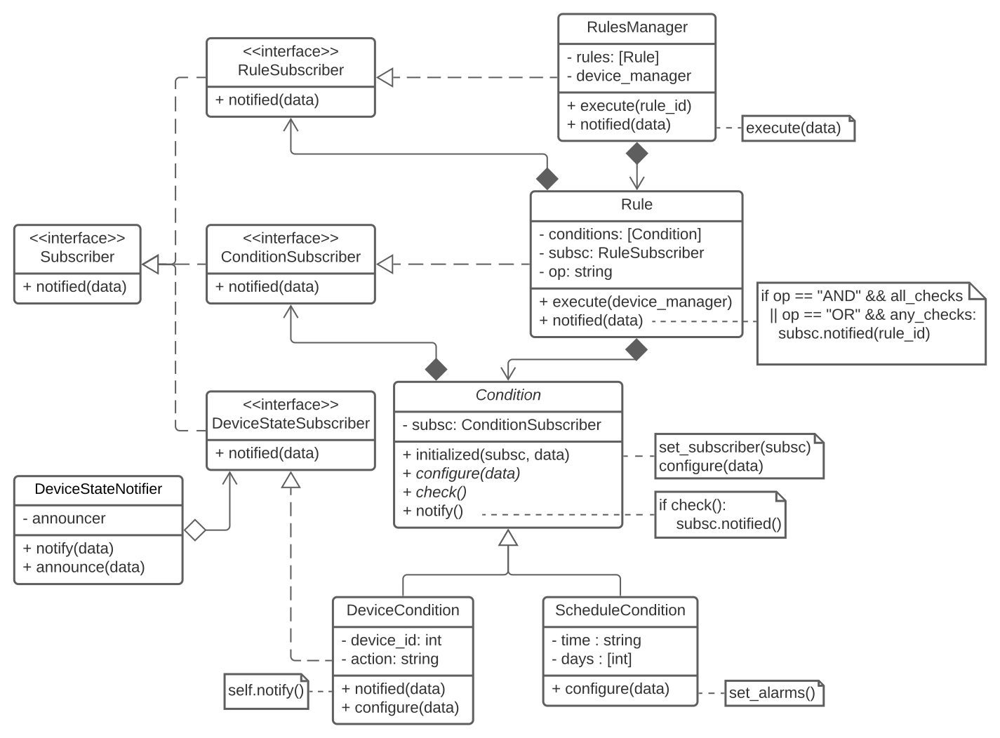

<!--
Why document pattern instances

Documenting pattern instances helps other developers understand a system, with its concrete classes, attributes and methods, and the design decisions behind them. This provides a level of abstraction higher than the class level, highlighting commonalities and thus promoting the understandability, conciseness and consistency of the documentation. At the same time, the documentation of pattern instances help developers to certify themselves that they're taking the right decisions. In general terms, this results in better communication in the development team and, consequently, in less bugs.

The documentation of pattern instances, allows other designers to learn from them and makes it possible to trace the design path from the problem to the implementation of the solution. It can easily reflect the similarities and differences between the several problems encountered during analysis and design, and contribute to eventually finding common compositions of patterns that are particular to the problem domain at hand, thus promoting the understandability, conciseness and consistency of the documentation, and preserving development knowledge.
-->

<!-- How to write pattern instance documentation

To formally document a pattern instance we must describe the design context, the design problem to solve, why the pattern was selected given the context and problem, how the pattern roles, operations and associations are mapped to the concrete design classes and the consequences of instantiating the pattern. You can find an example of this kind of documentation in the third section of ["JUnit: A Cook's Tour"](https://web.archive.org/web/20221128004056/junit.sourceforge.net/doc/cookstour/cookstour.htm).

Likewise, in this document each section should describe a different pattern instance. Name the sections according to the design problems that you have solved, and structure them according to the following sub-sections:

 * **Problem in Context.** Describe the wider design context and the concrete problem to be solved. This must be as complete as possible, someone else other than the original designer should be able to read and understand why it was important (and not trivial) to solve this problem.
 * **The Pattern.** Identify the pattern that you applied, why it was selected and how it is a good fit considering the existing design context and the problem at hand. Must include:
   * An enumeration and brief description of how the pattern _roles_, _operations_ and _associations_ were mapped to your concrete implementation.
   * Links to the corresponding source code blocks on your implementation.
   * Figure(s) illustrating your implementation of the pattern (e.g., class diagram, activity diagram).
 * **Consequences.** Benefits and liabilities (pros and cons) of the design after pattern instantiation, and comparison of these consequences with those of alternative solutions. This section should _not_ describe generic consequences of the pattern, but the specific ones of applying the pattern in your system.
-->

# House of Things – Pattern Instances

## Database Connection: Singleton [OUTDATED, TODO: UPDATE] [TODO Pedro Gonçalo]

### Context

When accessing the database, we need to be able to keep a single connection that we access in the different endpoints of our application.

#### Problem in Context

We want to ensure that there is a single database connection opened in our application at any time, and that this same connection can be used in any part of the application. This last requisite isn't so trivial to solve given that each endpoint to our REST API is a Flask view, so it doesn't receive parameters other than the URL parameters. This makes passing objects around more difficult.

Moreover, we desire that establishing the connection to the database is abstracted away from its use, since it should be established only once and the code that uses the database shouldn't have to worry about whether the connection has already been established or not.

#### The Pattern

We have selected the Singleton pattern to solve this problem, since it provides the following advantages:

- provides consistency, in the way that it ensures there is only one database connection that is reused accross the application, reducing overhead.
- provides a global point of access to the database connection, which can be used in any endpoint.

### Mapping

Due to the specificities of Python, namely the fact that there is no way to declare a constructor private, the Singleton pattern acquires a slightly different form than usual. The method we adopted makes use of metaclasses.

The class [`DB`](https://github.com/FEUP-MEIC-ASSO-2023/G5/blob/develop/backend/src/database/DB.py) is the Singleton, of which only one instance may exist. Its metaclass, [`DBMeta`](https://github.com/FEUP-MEIC-ASSO-2023/G5/blob/develop/backend/src/database/DB.py) overrides the `__call__` method, which takes the role of getting the instance to `DB`, creating one if needed (tradicionally, this role would have been fulfilled by a `getInstance()` method in the Singleton class). Overriding the `__call__` method of the metaclass also has the side effect of hiding the constructor of the Singleton class, which is a good thing, since it effectively has a similar effect to making the constructor private. The metaclass also holds the set of instances of Singleton classes that use it as a metaclass. In our current implementation, only `DB` uses it as its metaclass, so there may only be one instance.

<div align="center">
  
  <p style="margin-top:10px"><i>Figure 1: HoT Singleton Pattern</i></p>
</div>

### Consequences

Although it provides the aforementioned advantages, this pattern has some downsides, as it promotes tight coupling between the components of the application and makes it difficult to unit test the code associated with the Singleton. However, if we limit the code of this class to establish and use the connection to the Mongo database, which we don't need to test thoroughly (as we would basically be testing Mongo itself), we think that this pattern's benefits outweight its liabilities.

Since with this implementation of the pattern the Singleton's lifecycle is managed by the metaclass, contrary to the tradicional implementation, it does not violate the Single Responsibility Principle. In fact, the Singleton class itself is only responsible for establishing and using the connection to the database, and doesn't have to worry about whether it is a Singleton. It only needs to specify its metaclass.

As an alternative to this pattern, we could encapsulate the connection to the database as a regular class and instanciate it. Although being able to instanciate this class would facilitate its unit testing, it would be harder to pass this instance around the application, especially to the Flask views. There is also the possibility of using a global variable to store the database connection, but this would be even more difficult to unit test and also be more easy to misuse in a way that causes unintended side effects, such as rewriting the contents of the variable.

---

## PyMongo Abstraction: Facade

### Problem in Context

PyMongo is the Python distribution containing tools for working with MongoDB and it offers a large amount of tools not necessary for the development of House of Things.

We start using PyMongo to interact with the MongoDB database on the server side of the House of Things. The library offers many tools, since the simpler ones, like creating collections and inserting documents, until the most complex ones, like indexes and replication.
However, the use of the library in the House of Things project is very restrict and focused on the basic operations of a database and having so many operations available can be messy.
Beyond that, it is needed to ensure the connection between the aplication and the database before each operation executed on the database.

These two problems together can lead to a greater difficulty in development and make the code become more confusing and complex.

### The Pattern

We have selected the Facade pattern to solve this problem, since it offers the following advantages:

- provides a single way to connect the database and avoid it to be called everytime it is need to make a database operation.
- provides specific methods, only the ones required for the context of House Of Things, abstracting the entire application of the PyMongo library but a single a class.

The class [`DBCollection`](https://github.com/FEUP-MEIC-ASSO-2023/G5/blob/master/backend/src/database/DBCollection.py) is the Facade class which depends on **PyMongo**.
This class is associated with every class that needs to access the Database ([`Device`](https://github.com/FEUP-MEIC-ASSO-2023/G5/blob/master/backend/src/model/devices/Device.py), [`Rule`](https://github.com/FEUP-MEIC-ASSO-2023/G5/blob/master/backend/src/model/rules/Rule.py), [`Division`](https://github.com/FEUP-MEIC-ASSO-2023/G5/blob/master/backend/src/model/Division.py), etc.)

<div align="center">
  
  <p style="margin-top:10px"><i>Figure 2: HoT Facade Pattern</i></p>
</div>

### Consequences

This pattern revealed to be very useful to reduce the quantity of code needed to interact with the database and keep them consistent. It allowed to have a single spot where the schema of the documents in the database are defined for each collection. It also allowed to have a dozen of simple and concise methods instead of having to choose between many more by choosing to interact directly with PyMongo.

This pattern also have downsides like being a "god instance", in which every class that accesses the database must know. 

As it was generalized to be able to access different collections with similar methods the Single Responsability Principle  was not violated, even though it knows how to interact with device, categories, rules, divisions and all other future collections in the database.

---

## Real Devices Interaction: Strategy

### Problem in Context
Each real world device has its own way of being controlled and its own way of sending data. This means that each device has its own communication protocol, including the discoverabilty, connection and action protocols. Therefore, it is necessary to have a way to interact with each device in a different way, what would lead to a lot of dependencies between the classes that interact with the devices and the classes that represent the devices.

### The Pattern
In order to make the device class unaware of the specific protocol used to communicate with the device, we have used the Strategy pattern. This pattern allows the device to simple know an interface that it can use to communicate with the device, and the specific protocol is implemented in a class that implements that interface. This way, the device class is not aware of the specific protocol used to communicate with the device.

Since the device connector is attached to the device class on its creation, every time the device needs to communicate with the real device, it simply calls the methods of the connector, without knowing the specific protocol used to communicate with the device, but knowing that somehow the connector will be able to communicate with the device, independently of the protocol used.

<div align="center">
  
  <p style="margin-top:10px"><i>Figure x: HoT Real Device Interaction - Strategy Pattern</i></p>
</div>


### Consequences

This pattern allows the device class to be unaware of the specific protocol used to communicate with the device, which is a big advantage, since it allows the device class to be independent of the specific protocol used to communicate with the device.

Devices manager must be aware of the different strategies to be able to select a proper one for a device.

---

## Devices Connector Creation: Simple Factory

### Problem in Context

The model and controller class to be instanciated when a device is added is determined by a JSON object sent by the client in the request. This leads to a problem where those classes can't be instanciated _a priori_, so they need to be created dynamically, according to a certain input.

Devices can have different communication protocols, data formats, and capabilities. When a new device is added, the server needs to know how to communicate with it and how to interpret its data. However, the server should determine the connector to be used to communicate with the device, serving as the bridge between the real device and the one represented by the application, according to the device's category and communication protocol sent by the client in a JSON object as strings.

### The Pattern

The pattern corresponds to the existence of a factory class that has a single creational method and is able to create classes of a certain parent dynamically, according to the input.

The class [`DevicesManager`](https://github.com/FEUP-MEIC-ASSO-2023/G5/blob/master/backend/src/controller/managers/DevicesManager.py) is the factory class responsible to create the device connector classes (entities that know how to communicate to a physical device), according to the input received from the client. On the factory perspective, it has a single method `make_connector` that receives the configuration details of the connector to be created and returns the device connector class or any of its sub classes ([`DeviceConnector`](https://github.com/FEUP-MEIC-ASSO-2023/G5/blob/master/backend/src/controller/device_connectors/DeviceConnector.py)).

<div align="center">
  
  <p style="margin-top:10px"><i>Figure 3: HoT Simple Factory Pattern</i></p>
</div>

### Consequences

This pattern has a big disadvantage, since it forces the `make_connector` method of the class `DevicesManager` to be updated every time there is a new device connector class responsible for deal with a new real device. However, there aren't many alternatives to solve this problem, since the device adapter classes are created dynamically and the factory class needs to know the classes to be created.

The `Builder` pattern could be used to minimize the changes needed to be done since it would be possible to reuse, at least, parts of the communication protocol like the discoverability methods or connect and disconnect protocols. However, we would still not avoid the bad switch case.

Despite that, there is a solution that can be further explored to solve this problem consisting on metaprograming to determine what DeviceConnector classes could be feasible to be created from the configuration details received from the client.

---

## Device Structure: Decorator

### Problem in Context
There are almost infinite devices in the world and each one has its own capabilities and combination of funcionalities. This means that it would be necessary to create a class for each device, which would be impossible to maintain, and would lead to a lot of duplicated code. Although, each device has a finite set of capabilities like turning it on or off, getting the environment temperature, etc, and these capabilities may be reused among different devices.

### The Pattern
In order to solve this problem, we have used the Decorator pattern. This pattern allows us to create a class for each capability, and then combine them to create an object that has all the capabilities of the device and represent it. This way, we can reuse the capabilities among different devices, and we can create a class for each device by combining the capabilities that the device has.

Beyond the device capabilities, it also has some specific attributes like the name of the device, the divisions that it belongs to and the knowledge of how to communicate with the real device (through the `DeviceConnector`). Therefore, the `Device` class is the decorator class that combines the capabilities and the concrete device (`ConcreteDevice`), the one that has the other attributes. Each capability is represented by a class that inherits from the `Device` class, the `BaseCapability`. The `BaseCapability` must contain another `Device` object, which is another capability or the concrete device. Each subclass of `BaseCapability` must be a single and small capability, like a Power capability or a Temperature capability. Each capability has its own state and its own way of being updated.

The final representation of a device will consist on `BaseCapability` on top of other `BaseCapability` until the concrete device is reached. This way, the concrete device will be always reachable as well as all the capabilities of the device.

<div align="center">
  
  <p style="margin-top:10px"><i>Figure x: HoT Device Structure - Decorator Pattern</i></p>
</div>


### Consequences
This pattern allows us to reuse the capabilities among different devices and create an instance of a device from any capabilities combination.

The creation of the device could become very complex, since it is necessary to create a lot of objects and combine them. However, the solution to this problem was figured out and it is explained in the next section.

As a disadvantage, any `Device` is aware of the concrete device through the `get` method that, from any point of the stack of `BaseCapability`, returns the concrete device by calling the `get` method of the `Device` object that it contains until the concrete device is reached and returns itself. This makes the methods of the `ConcreteDevice` being accessible from any `BaseCapability` without overload the `Device` class with methods not needed for a simple capability class, however it makes a bidirectional dependecy, even though it is not severe.

This structure ended by not being very helpfull since it made the decisions fall on a chain of responsabilities through all the `Device`s stacked very often.

An other possibility to address this problem would be to use the `Composite` pattern, which associate the capabiilities to a device without making them a `Device`. It would be probably simpler, although it would not eliminate all the problems with the chain of responsabilities previously mentioned.

---

## Device Creation: Reflection

### Problem in Context
The creation of a device is a complex process since it is necessary to create a lot of objects and combine them. The objects to be created vary with the capabilities that a real device has, and consequently the list of capabilities a `DeviceConnector` provides. An obvious way to do this would be to have a switch case and for each capability create the respective object and combine them. However, this would be very hard to maintain and would not be scalable.

### The Pattern
The solution to this problem was to use the Reflection pattern on a smaller scale. The capabilities provided by the `DeviceConnector` should have names that matches with the cabalities classes names. At the time of the device creation, as it already knows its connector, and consequently the capabilities that it provides, it can use the Reflection pattern to create the capabilities objects dynamically and combine them.

The piece of code below demonstrates how a device structure is created from a list of capabilities by getting the module and class for a capability just from its name and the path to the capabilities classes package.

```python
connector: DeviceConnector = make_connector(cid, uid, config)
capabilities: list[str] = connector.get_capabilities()
device = ConcreteDevice(uid, config, connector, notifier)
for capability in capabilities:
    capability_classname = f"{capability.title().replace('_', '')}Cap"
    capability_module = importlib.import_module(
        f"src.model.devices.capabilities.{capability_classname}"
    )
    capability_class = getattr(capability_module, capability_classname)
    device = capability_class(device, notifier, data)
```
### Consequences
This pattern allows us to create a device from a list of capabilities and it doesn't scale with the number of possible capabilities as it would happen with a switch case.

It makes the code very flexible and scalable, however it has the disadvantage of not being able to check if the capability name is correct at compile time, which could lead to errors at runtime.

---

## Device Actions: Chain of Responsibility

### Problem in Context
There is a specific command (e.g. turn_on, set_color, ...) to make an action in a device but only a respective capability has the capacity to understand the request and execute it. Therefore, the server needs to know which capability is responsible for the action requested by the client and send the request to the respective capability. It would be very hard to get the correct handler _à priori_.

### The Pattern
The solution to this problem was to use the Chain of Responsibility pattern. This pattern consists on a chain of objects - already implicit due to the Decorator structure used to represent devices - that can handle a action request. If it can handle the request, it executes the action, either way it passes the request to the next object in the chain. The request transmission is not stoped when it is handled because it needs to achieve the `ConcreteDevice` to execute the action in the real device, as only this one knows the connector. This way, the server only needs to send the request to the first object of the chain, and the request will be passed through the chain until it reaches the correct handlers.

<div align="center">
  
  <p style="margin-top:10px"><i>Figure x: HoT Device Actions - Chain of Responsibility Pattern</i></p>
</div>

### Consequences
This pattern is very suitable together with the Decorator pattern already in use and explianed before, as it is already a chain of objects.

The main advantage of this pattern is that the server does not need to know which capability is responsible for the action requested by the client, it only needs to send the request to the first object of the chain. This way, the server is decoupled from the capabilities and the capabilities are decoupled from each other.

The main disadvantage of this pattern is that the request is passed through the chain until it reaches the final handler, which means that the request is passed through all the capabilities of the device. This can be a problem when the chain of responsibilities is long, since it is passed through all the capabilities of the device. However, we are not counting with a long chain of responsibilities, since the devices use to be simple and have a few capabilities so this issue may not be a problem on practice.

---

## Device Self Updated: Observer

### Problem in Context
There some devices where its state is updated by itself, like a temperature sensor that records changes not upon an action request but at every moment. Therefore, the server needs to be aware of these changes to change its state according to the new updated temperature.
The new temperature record is capture by a specific `DeviceConnector`, that can, for instance, be a MQTT client that is subscribed to a topic where the temperature sensor publishes its new records. The problem is that this works assynchronously, so the server needs to be aware of the new record to update the device state but the `DeviceConnector` doesn't know how to update the device state directly.

### The Pattern
The solution to this problem was to use the Observer pattern. On the creation of capabilities for a device that needs to be updated by itself, the capability is subscribed to the `DeviceConnector` as it implements, undirectly,  a `Subscriber` interface while the connector extends a `Publisher`. This way, the capability is notified when the `DeviceConnector` receives a new record and can update the device state accordingly.

This kind of cabality should extend the SelfUpdatedCap class, which implements the `Subscriber` interface and take the action when it is notified by the `DeviceConnector`.

NOTE: The Publisher is an Abstract Class instead of an Interface because the implementation of its methods are needed in other places and this way they can be reused.

<div align="center">
  
  <p style="margin-top:10px"><i>Figure x: HoT Device Self Updated - Observer Pattern</i></p>
</div>

### Consequences
The use of this pattern in this context allows the server to be aware of the changes in the device state without the need of making a request to the device to get the new state.

The main advantage of this pattern is that the `DeviceConnector` stays decoupled from the capabilities, since it only needs to notify the general `Subscriber` interface.

---

## Device State Update: Template Method

### Problem in Context
There are some devices capabilities that need to be updated by a specific action from the user, like a light that needs to be turned on or off and others that are updated by themselves. The update of a capability state should have always the same procedure, like the update of the state in the database and the notification of the state changed to its listeners, including the SSE listening route. However, each capability has its own state and because of that it slightly varies from capability to capability.

### The Pattern
To better approach this situation we used the Template Method pattern. This pattern consists on a method that defines the steps of an algorithm, but leaves some of the steps to be implemented by the subclasses. In this case, the `update_state` method is defined in the `BaseCapability` class and, beyond the steps that are always the same, it calls the `build_state` method to get the state structure for a specific capability. This method is an abstract method that is implemented in each capability class so that everyone of them can update its state accordingly.

<div align="center">
  
  <p style="margin-top:10px"><i>Figure x: HoT Device State Update - Template Method Pattern</i></p>
</div>

### Consequences
The main advantage of this pattern is that it allows to define all the steps of the update of a capability state in a single method, which makes the code more readable and maintainable and it also allows to save the state in a very defined way, accoridng to the capability.

---

## Division Devices Management: Observer [TODO Pedro Gonçalo]

## Rule Execution: Command & Composite

### Problem in Context
The system has rules that can be executed manually or upon a fullfiled condition combination. The rules are composed by a set of actions that are all executed when the rule is executed. Each kind of action can have a different behavior when executed, like a notification that is sent to a user and a device action that is sent to a device. However, the skeleton can be the same since they are all an execution of a specific action.

### The Pattern
The solution to this situation was to use a combination of the Composite and the Command patterns. Since both the rule and each of its specific action can be "executed" they can all implement the `ActionExecutor` interface. This interface has a single method, `execute` that is called when the instance should execute its action. Since the rule is composed by a set of actions, it can be represented by a composite of `ActionExecutor` instances. This way, when the rule is executed, it calls the `execute` method of each of its actions, which are executed accordingly.

<div align="center">
  
  <p style="margin-top:10px"><i>Figure x: HoT Rule Execution - Command & Composite Pattern</i></p>
</div>

### Consequences
The main advantage of this pattern is that it allows to execute a rule and all its actions in a single method call, which makes the code more readable and maintainable.

The composite and command patterns are known to be very compatible with each other and allow to create a very flexible and extensible code. This is the case of this pattern, since it allows to add new actions to the system without the need of changing the code of the rule execution.

---

## Device Bridge To Notify Rules: Bridge And Observer

### Problem in Context
The rules can be executed upon the verification of a certain composition of conditions and a type of these conditions is a `DeviceCondition` that is verified according to a device state. Therefore, this kind of condition should be aware of the changes in the device state to verify if the condition is fullfiled or not. However, the `DeviceCondition` doesn't have direct access to the device state and it would also be preferable to avoid polling the device state to check this.

A simple observer pattern would not be enough to solve this problem since a `DeviceCondition` should subscribe a `Device` but, since the device instance is a composition of capabilities and when a capability is updated just the self knows about the update of its state, this would not be enough to notify the `DeviceCondition` that the device state has changed.

### The Pattern

The solution to this problem was to use a combination of the Bridge and Observer patterns. The `DeviceCondition` implements a `DeviceStateSubscriber` interface that thinks to be subscribed to a `Device` (a subclass of a `Publisher`). However, for the condition to be subscribed to the whole device and not just some capabilities it is demanded that each `Device` that composes a device instance has the same `DeviceStateNotifier` instance. This way, when a capability updates its state, it notifies the `DeviceStateNotifier` instance that notifies the `DeviceCondition` that the device state has changed.

This means that the `DeviceStateSubscriber` is in fact subscribed to a `DeviceStateNotifier`, although it thinks it is subscribed to a `Device`, and it will be notified on every change of the device as a whole since every capability redirects the notify action to the notifier common to all the capabilities of the device. 

<div align="center">
  
  <p style="margin-top:10px"><i>Figure x: HoT Device Bridge To Notify Rules - Bridge And Observer Pattern</i></p>
</div>

### Consequences
The main advantage of this pattern combination is that it allows to notify the `DeviceCondition` that the device state has changed without the need of polling the device state and reduce the complexity that would exists if the condition needed to be subscribed to each capability of a device individually.

The bridge pattern allows to decouple the `Device` from the `DeviceStateSubscriber`s, although it acts as a middle man between the `DeviceCondition` and the actual `Publisher`, the `DeviceStateNotifier`.

---

## Rule Automated Execution: Observer and Chain of Responsibility

### Problem in Context
Besides the manual execution of rules, the system also has the capability of automatically executing rules when a condition is verified. This means that the system needs to be aware of the changes in the device state to verify if a condition is fullfiled or not in the case of a `DeviceCondition` or the alarm received when a `ScheduleCondition` is triggered. However, the `Rule` and consequently its actions, should only be exxecuted if all the conditions are met in the `AND` operation case or if at least one of the conditions is met in the `OR` operation case.

As the trigger happens on the condition level, the `Rule` should be notified when a condition is met in order to verify if the rule can be executed or not. However, the `Rule` is not capable of self executing, since it needs some external properties to execute, like the `DeviceManager` in order to get a device instance and take an action on it, for example in the case of a `DeviceAction`. Therefore, the `Rule` should notify the `RuleManager` that it can be executed and the `RulesManager` should execute the rule.

### The Pattern

The solution to this problem was to use a combination of the Observer and Chain of Responsibility patterns. Excluding the manual execution, the rule execution starts always from a condition trigger. As the rule already contains the conditions and the trigger information should be passed backwards until the top, each `Rule` implements a `ConditionSubscriber` and each condition has its own `ConditionSubscriber` that it is responsible to notify when the condition is met. In the same way, each `Rule` as a `RuleSubscriber`, implemented by the `RulesManager`, that is notified when the rule must be executed.

Before notify the `Rule`, the condition verifies if it is met or not. If it meets the condition, it notifies the `Rule` which by its turn notifies the `RulesManager` only if all the conditions associated are met or at least, depending on the operation value of the rule. The `RulesManager` then executes the rule passing it the `DevicesManager` instance that is needed to execute some of the actions of the rule. This is clearly a chain of responsibility.

<div align="center">
  
  <p style="margin-top:10px"><i>Figure x: HoT Rule Automated Execution - Observer and Chain of Responsibility Pattern</i></p>
</div>

### Consequences
The main advantage of this pattern combination is that it allows to notify the `Rule` that it can be executed without the need of polling the conditions.

This patterns also allowed to avoid the bidirectional dependecy between `Condition` and `Rule`, and between `Rule` and `RulesManager`.

On the other hand, this strategy makes the code more complex and harder to understand. It also, forces the existence of subinterfaces of `ConditionSubscriber` and `RuleSubscriber` that does not add any value to the `Subscriber`. However, they are helpful to make the code more readable and to force the subscribers to be of a more specific type.

---

## CRUD API: Template Model [TODO Pedro Gonçalo]


<!-- ## Devices Creation: Factory Method [OUTDATED, TODO: REMOVE]

### Context

There are different models that can be created according to a specific input. Each model has its specific state and behavior.

#### Problem in Context

Devices can have different data formats, and capabilities. When a new device is added, the server needs to create the model of the device in order to save it in the database. This leads to a problem where each device model needs to be treated in a different way and with a different data structure.

#### The Pattern

The pattern **Factory Method** is a creational pattern that provides an interface for creating objects in a superclass, but allows subclasses to alter the type of objects that will be created. The pattern is used to create objects without specifying the exact class to create, while this responsability is delegated to the Factory subclasses.

### Mapping

The class [`DeviceAdapter`](https://github.com/FEUP-MEIC-ASSO-2023/G5/blob/develop/backend/src/controller/adapter/DeviceAdapter.py) is the Creator/Factory class that as an abstract method `create_model` that is implemented by the subclasses of `DeviceAdapter` ([`LightBulbPiAdapter`](https://github.com/FEUP-MEIC-ASSO-2023/G5/blob/develop/backend/src/controller/adapter/LightBulbPiAdapter.py), [`ThermometerPiAdapter`](https://github.com/FEUP-MEIC-ASSO-2023/G5/blob/develop/backend/src/controller/adapter/ThermometerPiAdapter.py), and others). In this context the factory method is the `create_model` method and it does not returns the model class as most known one, but instead it assigns it to the `model` attribute of the `DeviceAdapter` class to be used later in the flow.

<div align="center">
  
  <p style="margin-top:10px"><i>Figure 4: HoT Factory Method Pattern</i></p>
</div>

### Consequences

This pattern has a big advantage, since it allows the creation of new device models without the need to change the `DeviceAdapter` class. However, it may lead to a lot of subclasses of `DeviceAdapter` that can be hard to maintain. Since we expect to have multiple adapters for each single device model, we expect that we will not run into the parallel hierarchy problem.

--- -->
